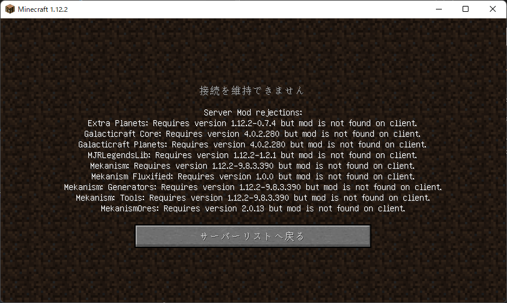
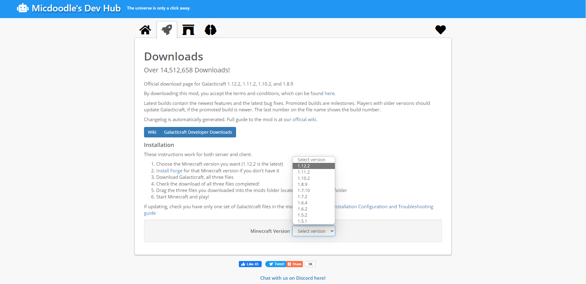
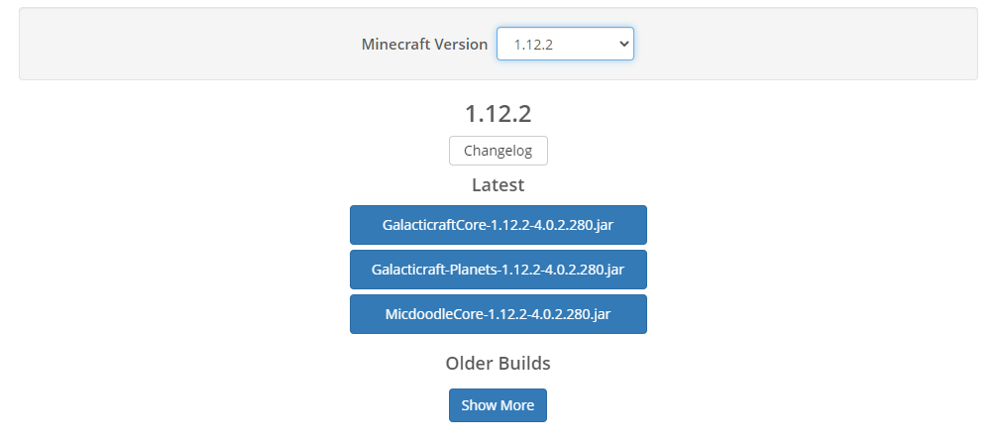
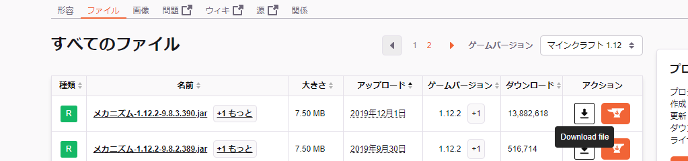

# Modの入れ方
2022/03/14

## 前提MOD
- Forege forge-1.12.2-14.23.5.2860-installer.jar
- Optifine OptiFine_1.12.2_HD_U_G5.jar

> [Tips] MacOSの場合、`OptiFine_HD_U_G6_pre1.jar` の方がクラッシュ率低いかも...
>
> Reason: https://optifine.net/changelog?f=preview_OptiFine_1.12.2_HD_U_G6_pre1.jar

### Modを入れないで入るとどうなる..?

---

## 主要Mod
今回入れるmodです。

### Galacticraft
https://w.atwiki.jp/minecraft/pages/1188.html

DL: https://micdoodle8.com/mods/galacticraft/downloads

1. サイトにアクセス: https://micdoodle8.com/mods/galacticraft/downloads
1. `Minecraft Version` から `1.12.2` を選択してください。

そして以下の三つをダウンロードしてください。
- GalacticraftCore-1.12.2-4.0.2.280.jar
- Galacticraft-Planets-1.12.2-4.0.2.280.jar
- MicdoodleCore-1.12.2-4.0.2.280.jar

### Mekanism
https://w.atwiki.jp/minecraft/pages/1266.html

DL: https://www.curseforge.com/minecraft/mc-mods/mekanism/files/all?filter-game-version=1738749986%3a628

- Mekanism-1.12.2-9.8.3.390.jar

---

## Mod + addon/modules

### Galacticraft + ExtraPlanets
ExtraPlanets-1.12.2-0.7.4.jar

DL: https://www.curseforge.com/minecraft/mc-mods/extraplanets/files/all?filter-game-version=1738749986%3a628

MJRLegendsLib-1.12.2-1.2.1.jar

前提ModDL:https://www.curseforge.com/minecraft/mc-mods/mjrlegendslib/files/all?filter-game-version=1738749986%3a628

### ~~Galacticraft + Galaxy Space~~
<s>
GalaxySpace-1.12.2-2.0.18.jar

DL: https://www.curseforge.com/minecraft/mc-mods/galaxy-space-addon-for-galacticraft/files/all?filter-game-version=1738749986%3a628

AsmodeusCore-1.12.2-0.0.30.jar

前提ModDL: https://www.curseforge.com/minecraft/mc-mods/asmodeuscore/files/all?filter-game-version=1738749986%3a628
</s>

###  ~~Galacticraft + More Planets~~
<s>More-Planets-1.12.2-2.2.2-GC280.jar

DL: https://www.curseforge.com/minecraft/mc-mods/more-planets-gc-addon/files/all?filter-game-version=1738749986%3a628

SteveKunG's-Lib-1.12.2-1.2.0.jar

前提Mod①DL: https://www.curseforge.com/minecraft/mc-mods/stevekungs-lib/files/all?filter-game-version=1738749986%3a628

!mixinbooter-4.2.jar

前提Mod②DL: https://www.curseforge.com/minecraft/mc-mods/mixin-booter/files/all?filter-game-version=1738749986%3a628
</s>

### Mekanism + Fluxified
mekanismfluxified-1.12.2-1.0.0.jar

DL: https://www.curseforge.com/minecraft/mc-mods/mekanism-fluxified/files/all?filter-game-version=1738749986%3a628

### Mekanism + Generators
MekanismGenerators-1.12.2-9.8.3.390.jar

DL: https://www.curseforge.com/minecraft/mc-mods/mekanism-generators/files/all?

### Mekanism + Tools
MekanismTools-1.12.2-9.8.3.390.jar

DL: https://www.curseforge.com/minecraft/mc-mods/mekanism-tools/files/all?filter-game-version=1738749986%3a628

### Mekanism + Ores
mekores-2.0.13.jar

DL: https://www.curseforge.com/minecraft/mc-mods/mekanismores/files/all?filter-game-version=1738749986%3a628

以上で終わりです。お疲れ様です。

---

### 補足事項
取り消し線がついているものは、

https://docs.mjrlegends.com/ExtraPlanets/1.12.2compact/ 

上記のリンクの通りに設定すれば、クラッシュすることなく起動します。

Reason: https://discord.com/channels/930083398691733565/948178885797871676/952858500726399016
